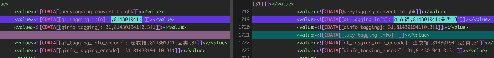
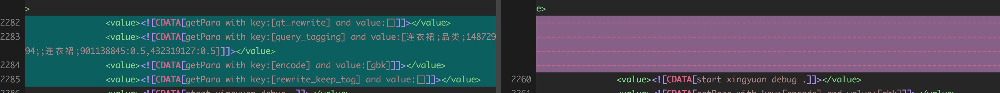
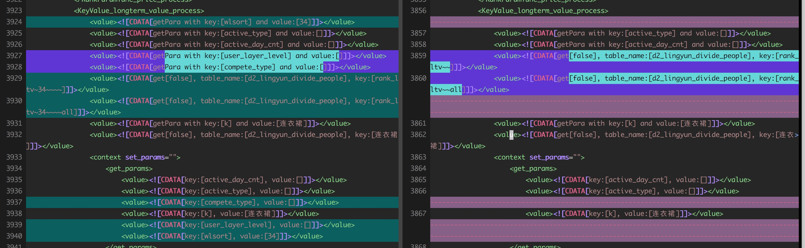

[TOC]


## awk 相关代码

### awk清除首尾空格

``` shell
awk -F\, '{gsub(/^[ \t]+/, "", $2); gsub(/[ \t]+$/, "", $2); print $2 ":"}'
```


### awk 过滤前置的编号

```shell
awk 'gsub(/^[0-9]([0-9])?[\\.、、，,]( )?/, "", $2);' a.txt
```


### awk split

```shell
set time = 12:34:56
set hr = `echo $time | awk '{split($0,a,":" ); print a[1]}'` # = 12
set hms = `echo $time | awk '{split($0,a,":" ); for (i=1; i<=3; i++) print a[i]}'`
```


## shell 命令相关


### shell 开启多线程


## shell 数字运算


Let expressions 执行一个或多个表达式。表达式中的变量前不必有$.如果表达式中包含了空格或其他特殊字符，则必须引起来。

例：let “I = I + 1” 或 let i=i+1


## shell 文件相关


### shell判断字符串是否相等

```shell
if [[ $1x == "ab"x ]]; then
    echo "you had enter ab"
elif [[ $1x == "cd"x ]]; then
    echo "you had enter cd"
else
    echo "you had enter unexpected word"
fi
```


### shell 遍历文件夹下文件

```python
dir=$1
for element in `ls $dir`
do
     file=$dir"/"$element
     if [ -d $file ]
     then
         getdir $file
     else
         echo $file 1>> /root/dir.out #将结果保存到/root/dir.out
     fi
done
```


### shell重定向

```shell
sh test.sh > log 2>&1   # 错误输出也重定向到1里面
```


### shell判断文件是否存在

```shell
if [[ ! -f $bizdate.done ]] ; then exit 0; fi   # 如果不存在done文件, 退出
if [[ -f $bizdate.done ]] ; then echo "exits"; fi   # 如果存在done文件

if [ ! -d "/data/" ];then
	mkdir /data
else
	echo "文件夹已经存在"
fi
```


### shell读取文件

```shell
#使用read命令读取一行数据
while read myline
do
echo "LINE:"$myline
done < datafile.txt
```


### shell 查找几天之前 or 几天之内更新的文件

```shell
find ./ -mtime +2 -name \*.done | xargs /bin/rm -rf;  # 删除两天之前的done文件
　
-mtime +n : 列出在n天之前（不含n天本身）被更改过内容的文件名
-mtime -n : 列出在n天之内（含n天本身）被更改过内容的文件名
```


### shell 多天进行循环

```shell
for ((i = 0; i <= $max_days - 1; i++)); do
    d=`date +%Y%m%d -d "$i day ago $DATE"`
    if [[ $? -ne 0 ]]; then continue; fi
done
```


### shell随机抽取的脚本

```shell

```


### shell 读取命令行参数

| 变量 | 含义                                                         |
| ---- | ------------------------------------------------------------ |
| $0   | 当前脚本的文件名                                             |
| $n   | 传递给脚本或函数的参数。n 是一个数字，表示第几个参数。例如，第一个参数是$1，第二个参数是$2。 |
| $#   | 传递给脚本或函数的参数个数。(不包含脚本本身)                 |
| $*   | 传递给脚本或函数的所有参数。                                 |
| $@   | 传递给脚本或函数的所有参数。被双引号(" ")包含时，与 $* 稍有不同，下面将会讲到。 |
| $?   | 上个命令的退出状态，或函数的返回值。                         |
| $$   | 当前Shell进程ID。对于 Shell 脚本，就是这些脚本所在的进程ID。 |


### shell 字符串操作

```shell
比较两个字符串是否相等的办法是：

if [ "$test"x = "test"x ]; then
    这里的关键有几点：
    1 使用单个等号
    2 注意到等号两边各有一个空格：这是unix shell的要求
    3 注意到"$test"x最后的x，这是特意安排的，因为当$test为空的时候，上面的表达式就变成了x = testx，显然是不相等的。而如果没有这个x，表达式就会报错：[: =: unary operator expected
```


## vim相关代码


### vim删除耗时

```
:g/<value><!\[CDATA\[[0-9]\+]]><\/value>/d
:g/time_cost_us/d
:g/use existing KVSearchWrapper/d
:g/getPointerPara with key/d
```


### vim 支持新的文件高亮

```
vim ~/.vimrc 添加如下行

au BufNewFile,BufRead *.c96 set filetype=c

某个工程下的C代码都是以.c96为后缀名命名的，如果直接打开该文件，则vim不认为这个文件时c文件，因此不会启动语法高亮。

解决办法：

vim ~/.vimrc 添加如下行
au BufNewFile,BufRead *.c96 set filetype=c

注：其实vim的语法高亮规则都是在syntax目录下定义的，为什么filetype=c就一目了然的。
/usr/share/vim/vim61/syntax/c.vim
```


### vim 自动插入序列

- 插入序列
    -  %s#"$#\=line(".")#g --- 直接追加序号
    - 215,233s#"$#\=line(".")-214.":"#g ---序号后面追加了:
    - 215,233 s # "$ # \=line(".")-214."\""#g
    - 注意: 是\=line() 后面的" " 是在公式后面追加其它正常的字符
    - 

###vim 里面查找满足多个条件的命令

* ```shell
    /1375\|1406
    :g!/1375\|1406/d
    ```


### vim 跨行搜索

```
vi平时我们使用的匹配字符"."不能够匹配换行符号，所以我们没法使用它进行跨行匹配。
如有以下数据：我们想查找所有在城市为beijing,年龄为18岁的人。

name: A
city: beijing
age: 18
name:B

此时"."就无能为力，我们需要用 "\_."
/citi: beijing\_.*age:18
```


### shell 随机抽取的脚本

```shell
source ~/.bashrc
source ~/.bash_profile
LC_ALL=C

alias echot="echo -e [`date "+%Y-%m-%d %T"`]"

if [[ $# -ne 3 ]] ; then
    echo "<Usage>: sh getRandom.sh inFile randomNum outFile"
    exit 1
fi

function random()
{
    local min=$1
    let max=$2-$1
    local num=`date +%N`
    let local retnum=10#$num%10#$max+10#$min
    echo $retnum;
}

# 1: get the line number
lnum=`wc -l $1 | cut -d " " -f 1`
echot "[Info] File Name: "$1
echot "[Info] Lines Num is: "$lnum

# 2: get the random indexs first
echot "[Info] Begin Get Random Nums:"$2
declare -a randomNums

for((index=0; index<$2;))
do
    curNum=`random 0 $lnum`
    if [[ ${randomNums[$curNum]} -ne 1 ]] ; then
        randomNums[$curNum]=1
        let index=index+1
    fi
done
echot "[Info] End Get Random Nums:"$2

#3：read all the lines from input file, but didn't save in the memory
index=0
getNum=0
declare -a lines

echot "[Info] Begin Read Lines"
while read line
do
    if [[ ${randomNums[$index]} -eq 1 ]] ; then
        lines[$getNum]=$line
        let getNum=getNum+1
    fi
    if [[ $getNum -eq $2 ]] ; then
        break
    fi
    let index=index+1
done < $1
echot "[Info] End Read Lines"


#4：wirte choosed lines into file
cat /dev/null > $3
for i in "${!lines[@]}" ; do
    echo "${lines[$i]}" >> $3
done
```


## git 相关


### 在提交的历史代码中搜索

git rev-list --all | xargs git grep rewrite


### 对比两个branch 某个文件/目录的差别

git diff  branch/or/commit another/branch/or/commit file/path


# 左边34， 右边46

* qt_tagging_info










