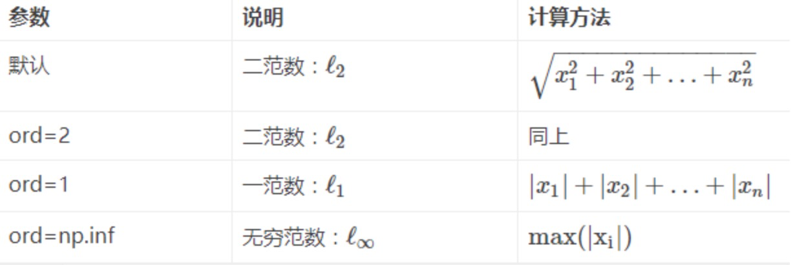

[TOC]

## np数学相关

### np求cosine 代码

```python
# coding: utf-8
import numpy as np

with open('./b1', 'r') as f1:
    for line in f1:
        vector1 = np.array([ float(w) for w in line.rstrip('\n').split(',') ])

with open('./b2', 'r') as f2:
    for line in f2:
        vector2 = np.array([ float(w) for w in line.rstrip('\n').split(',') ])

print vector1
print vector2

print "vector1 size:[%d]"%(len(vector1))
print "vector2 size:[%d]"%(len(vector2))

op7 = np.dot(vector1,vector2) / ( np.linalg.norm(vector1) * np.linalg.norm(vector2) )

print op7
```


### np求范数

1、linalg=linear（线性）+ algebra（代数），norm则表示范数

**x_norm=np.linalg.norm(x, ord=None, axis=None, keepdims=False)**

x: 表示矩阵（也可以是一维）




## numpy 矩阵运算


### 乘法 np.dot np.multiply, *

```python
np.dot(A, B)  #对于二维矩阵，计算真正意义上的矩阵乘积，同线性代数中矩阵乘法的定义。对于一维矩阵，计算两者的内积

element-wise product
# 在Python中，实现对应元素相乘，有2种方式，一个是np.multiply()，另外一个是*

```


### 矩阵转置: a2=a1.T

```python
>>> a1=mat([[1,1],[0,0]])
>>> a1
matrix([[1, 1],
        [0, 0]])
>>> a2=a1.T
>>> a2
matrix([[1, 0],
        [1, 0]])
```


## np.array 相关


### 数组排序argsort

我们发现argsort()函数是**将x中的元素从小到大排列**，**提取其对应的index(索引)，然后输出到y**。

```python
import numpy as np
x=np.array([1,4,3,-1,6,9])

x.argsort()  # 输出定义为y=array([3,0,2,1,4,5])。

np.argsort()[num] 
#当num<0时，np.argsort()[num]就是把数组y的元素反向输出，例如np.argsort()[-1]即输出x中最大值对应的index
```


### np.array slice

Numpy 中多维数组的切片操作与 Python 中 list 的切片操作一样，同样由 start, stop, step 三个部分组成

```python
slice_one = arr[:4]
print 'slice begins at 0 and ends at 4 is:', slice_one
```

上述例子是一维数组的例子，如果是多维数组，将不同维度上的切片操作用 **逗号** 分开就好了

```python
# coding: utf-8
import numpy as np

arr = np.arange(12).reshape((3, 4))
print 'array is:'
print arr

# 取第一维的索引 1 到索引 2 之间的元素，也就是第二行
# 取第二维的索引 1 到索引 3 之间的元素，也就是第二列和第三列
slice_one = arr[1:2, 1:3]
print 'first slice is:'
print slice_one

# 取第一维的全部, 按步长为 2 取第二维的索引 0 到末尾 之间的元素，也就是第一列和第三列
slice_two = arr[:, ::2]
print 'second slice is:'
print slice_two
```

对于维数超过 3 的多维数组，还可以通过 '…' 来简化操作

```python
# coding: utf-8
import numpy as np
arr = np.arange(24).reshape((2, 3, 4))

print arr[1, ...]               # 等价于 arr[1, :, :]
print arr[..., 1]               # 等价于 arr[:, :, 1]
```


### string to np.array

```python
import numpy as np
mystr = "100110"
print np.array(list(mystr))
# ['1' '0' '0' '1' '1' '0']
If you want to get numbers instead of string:

print np.array(list(mystr), dtype=int)
# [1 0 0 1 1 0]
```

### array加减乘除

- 两个向量相乘, 对应位置的元素相乘. 不是矩阵的乘法.不是矩阵的乘法

```python
X1 = np.array([[1,2], [3, 4]])
X2 = X1
print X2*X1

[[ 1  4]
 [ 9 16]]
```

### 创建array

- np.zeros( shape, dtype=float, )

### 修改二维数组

- 将其中一行整体修改为另外一行

```
embeddings[i] = embeddings[i] + self.word_embedding[word]
```

### numpy type转为python的 type

- Use either a.item() or np.asscalar(a) to convert most NumPy values to a native Python type:

```python
type(np.float32(0).item()) # <type 'float'>
type(np.asscalar(np.int16(0)))   # <type 'int'>
```


### numpy.random.choice 随机生成序列

numpy.random.choice(a, size=None, replace=True, p=None)

- 从给定的一维数组中生成随机数
- 参数： a为一维数组类似数据或整数；size为数组维度；p为数组中的数据出现的概率
- a为整数时，对应的一维数组为np.arange(a)

```python
np.random.choice(5,3)
array([4, 1, 4])
np.random.choice(5, 3, replace=False) # 当replace为False时，生成的随机数不能有重复的数值

np.random.choice(5,size=(3,2))
array([[1, 0],
       [4, 2],
       [3, 3]])
```

