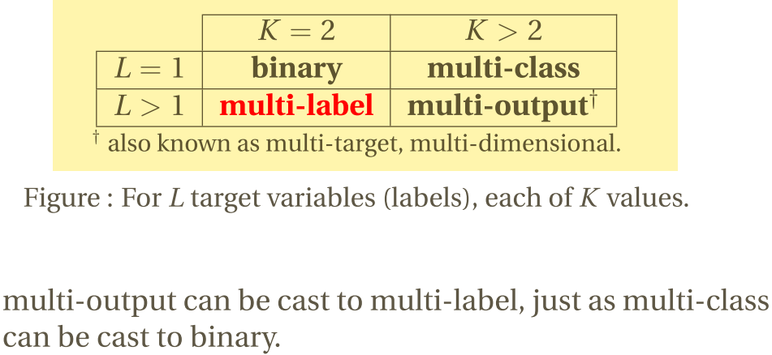

[TOC]

# 正则化时为什么不对bias_term进行惩罚

> 忘记什么时候被人问了一句, 在ML和DL的L1和L2中为什么只对weight进行惩罚, 不对bias term进行惩罚呢. 瞬间愣住了, 还真没有想到过这个问题. 

回来仔细做了下功课, 总结下. Try to Explain in My Own Language.

## bias term的作用
* w只能在y轴方向上压缩或者拉长函数曲线, 而bias term能够让函数曲线左右移动, 这样w和b的组合就能够拟合平面区间上的任何曲线.
* 为了简单起见, 就拿线性回归的方程式(eg: Y = w * x + b. )来解释下. 如果没有bias, 那么方程的形式 Y = w * x, 这个假设空间中的所有函数图像都是经过原点的直线, 但是更多的情况下, 最优的拟合曲线并不是经过原点的曲线,此时就需要bias来调整拟合的函数曲线. 

## bias term的正则化

* 正则化的目的是为了防止参数过于复杂导致的过拟合情况, 参数复杂情况是和 w 参数的个数直接相关的, 而bias并不会提高函数的复杂性, 只是对网络做了一个线性的平移. 因此bias term的存在并不会影响函数的复杂性情况. 因此正则项并不需要针对bias进行惩罚
* 如果对bias进行惩罚, 那么模型会偏向于选择距离原点进的函数曲线, 但是这没有任何意义..反而有可能会导致偏离了最优的函数曲线.

## 参考
* 下面是一些参考问答
    - 偏置单元（bias unit），在有些资料里也称为偏置项（bias term）或者截距项（intercept term），它其实就是函数的截距，与线性方程 y=wx+b 中的 b 的意义是一致的。
    - 在 y=wx+b中，b表示函数在y轴上的截距，控制着函数偏离原点的距离，其实在神经网络中的偏置单元也是类似的作用。
    - wx+b的b: 打个比方 有点(1,1) 属于1类  点(2,2)属于2类，请问是否能从原点画一条线把他们分开. --> 不可以，所以需要偏置值b，这样线段就不从(0,0)点出发了
    - 从数学层面上讲，偏置项可以将激活函数做横向平移。对于输入信号，可以通过乘以权重值将激活函数进行压缩或拉伸，但无法实现左右平移.
* 关于正则化
    - Moreover, in case a large offset is needed for whatever reason, regularizing it will prevent finding the correct relationship.
    - What's the purpose of regularisation? Isn't it to keep weight values as small as possible? Thus, what sense does it make to keep the discriminant function close to the origin when the data may well be strongly biased? Doing so (bias regularisation) clearly limits the learning expressiveness of the NN.

# 是否需要对training data进行去重
* 在一项实际的无监督任务中, 我们对样本进行了去重, 不过总感觉哪里不对. 那是否需要对train data进行去重呢.
*  我认为不必要, 而且不应该去重. 
    - 比如:在进行三叶草和四叶草的识别时候, 如果进行了去重,那么模型就认为三叶草和四叶草是等概率出现的.而实际情况是四叶草出现的概率是三叶草的一万分之一. 
    - 如果进行了去重, 就好像丧失了部分的先验信息.导致了训练数据的分布和实际分布不一致
    - 同时, 关于如何定义两个样本是相同的本身就比较难.
> Here is also an absurd example. Imagine x = y are in your data set. Here you will discard one of them. Now imagine x = y + e in your data set, where e is really small. No you don't discard x nor y + e, although both are about the same. So up to what distance will elements be considered equal? That's a pretty hard problem by itself.

# 样本不均衡, loss的变化

# multi-class task VS multi-label task VS multi-task task

最近被一个softmax的问题困扰了, 如果class的数目很多的话, 那么softmax的loss会很低, 梯度相对来说就很低了. 导致模型学习不动. 突然脑子里面有点分不清multi-class和multi-label的区别了. 记录下

## multi-class classification
* 多分类任务:二分类任务的延伸. 一条样本可能属于class set中的一个(只能属于一个,因为各个类别是互斥的关系,不能同时存在).
*  因此针对classes set中的每个class, 仍然是一个二分类问题. 不过各个二分类的结果要进行组合筛选top1
* eg: 一个水果的图片: 可以被识别为:橘子,香蕉,芒果,山竹.不过识别结果只能是其中一个

## multi-label classification
* 多类别分类任务: 一个样本可能属于label set中的多个label. label set中的各个label不是互斥关系, 可以并存的.
* 不过怎么感觉多label仍然是可以转换为二分类的集合, 不过可以组合各个二分类的结果, 选择topN?
* 针对每个label, 都是一个不同的分类任务, 不过由于label之间存在一定的关系,因此一起进行分类会比单独进行分类效果比较好. 一起进行分类, 可以学习到一些label之间的关联信息.
* eg: 预测一篇文章的topic task, 一个doc可以属于多个topic.

## multi-task classification
* 或者叫: multioutput-multiclass classification
* 是指使用一个单一的模型来一起处理多个clasiification task
    
具体各个任务的区别为:

