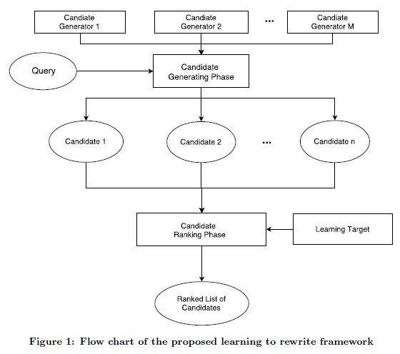
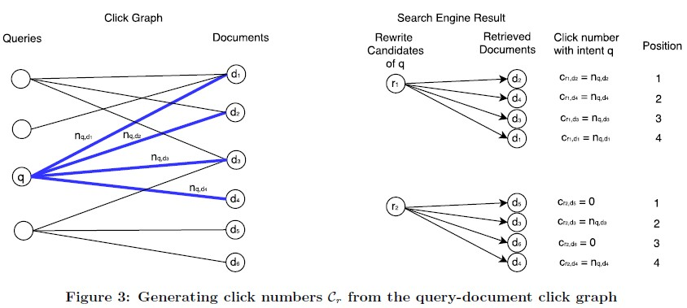

# 任务

>It is widely known that there exists a semantic gap between web documents and user queries and bridging this gap is crucial to advance information retrieval systems. 

* 目前通用的搜索引擎是按照全标题匹配 or 部分关键词匹配进行召回, 不过用户query和文档titile之间的语义分布不一致, 导致实际的搜索召回效果并没有达到最优. 本文的目标就是通过query rewrite来减少用户query和文档title之间的这种gap,

* 本文主要特点在于公式化定义了如何learning to rewrite query, 并给出了一个以搜索指标为目标的query rewrite 框架. 

# 模型

* 本文提到的query rewrite框架结构其实很简单, 是通用的一个召回 + 排序 结构. 框架结构图如下
    - 1: Generating phase来生成候选的改写query
    - 2: Ranking phase用于针对候选改写query进行排序

* Generating phase
    - 这个是利用现有的SMT和LSTM技术来生成rewrite query,没有什么好看的, 里面着重介绍了LSTM生成query的过程, 估计这种方法还比较新, 写了很多lstm科普性的只是来充字数...
    - 疑问的是他们只用了LSTM最后一个时间步的h去生成rewrite query, 感觉有点不靠谱, 各种bi-direction lstm 或者attention都没有加, 和国人写论文的风格不一样啊...
 
* Ranking phase
    - 这个部分是重点, 毕竟是第一次形式化定义learning to rewrite. 这个部分又分为了三个小节:Loss Function和Generating Learning Targets, feature
    - 1: Loss Function
        + 文章描述了下三种形式的损失函数: point wise, pair wirse, list wise, 如何应用在learning to rewrite 框架上.
    - 2: generating learing target: 
        + 最简单的目标就是人工标下rewrite query是否和original query相关...不过这个做法被作者鄙视了. (工作量大&需要经常更新&人也不好判断)
        + 文章自己是根据rewrite query在实际的点击二部图(query-document bipartite graph)中的点击情况来间接刻画rewrite query的质量
        + 假设 rewrite query能够召回的top k document, 计算original query对每个rewrite qeury召回的document 的click num以及这个document在rewrite query中的rank pos. 最终的目标就是优化 click num. 
        + 感觉本质上就是选择那些召回document和original query更相关的rewrite query, 通过共同点击次数来反应rewrite query是否和original query相关.
        + 直接使用click num比较暴力, 又对click num做了不同的平滑处理. sum(clickNum/pos), 对click num取log, 对目标再取log.
    - 3: feature
        + 特征工程没什么说的, 三种特征: query feature, rewrite query feature和query-rewriteQuery pair feature
        
    

# 实验 & 结论   

* Generating Phase
    - 文章使用了 query --> clicked title作为SMT和LSTM的训练语料.很奇怪, 估计是因为网页搜索里面document的title一般不会太长, 堆砌也比较少吧. 不过总觉得这种训练数据训练出来的结果不是太好.
*  Ranking Phase
    -  仍然是使用了NDCG去评估效果
*  结论
    -  1: SMT 或者 加上LSTM的learn to rewrite都能够比原始的SMT做rewirte提高不少.
    -  2: SMT和SMT+LSTM都在中低频query上提升最大(保持怀疑态度, 目标本身就和行为强相关,中低频应该学不太好啊)
    -  3: 果然使用了各种平滑之后的click num比原生态的click num提升很多.
    -  4: feature里面top 10里面有6个都是pair feature, 3个rewrite query featue, 1个query feature. 预料之中啊

# 总结

* 文章提到的模型和思想和我们上一年做的思路基本一样, 以为我们做的比较土, 结果人家论文都发了, 抢先了一步啊. 
* 文章介绍了下目前query rewrite通用的一种框架, 参考意义比较大.