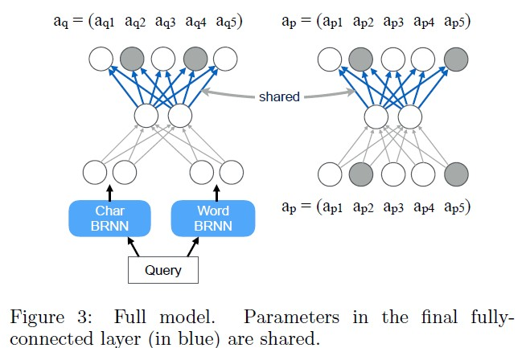

* Author: Chao-Yuan Wu, Amr Ahmed
* Time: www/2017

# 目标

> In this paper we study the problem of inferring the latent intent from unstructured queries and mapping them to structured attributes.

* 这篇论文主要是为了解决在无结构query中提取出用户隐含表达的一些意图, 使用这个隐含的意图来对召回的宝贝进行重新排序. 这个任务的一个基本假设是用户不会在query中显示的写出一些意图, 而是采用大众化的描述, 比如: "高端自行车", "高分辨率电视" 等.  很合理的一个场景, 毕竟大部分小白用户可不会记住各种专业的参数的.

* 这篇论文的另外一个背景是在购物网站, 主要原因应该是购物网站的宝贝是按照一种非常结构化的信息来表示的, 比如: 类目,品牌,尺寸等各种属性. 通过把自然描述的query映射到这些属性集合上, 能够提高商品的召回和排序效果.

* 具体来说,目标就是针对购物网站的搜索query, 找到一个最能提现用户想要表达的意图的属性集合.(Given a query, the goal is to find the subset of attributes that are most likely to represent the user intent.)

# 模型

* 这篇论文实现的模型很简单, 一个query网络 + 一个属性attribute网络

* query网络
    - 通过word-level和char-level的Bi-directional LSTM来学习query的represention.
    
* atrribute 网络
    - 通过autoencoder来学习一个item的represention, 
    - 主要目的是通过低纬度的represention在大量宝贝item样本里学习attribute之间的correlation
    
* 训练
    - 最终通过join两个网络一起进行学习. 一个特点就是最后的分类layer是共享参数的.
    - 感觉是为了在学习query到attribute映射时候加上一些先验知识, 以此来提高准确率.

* 网络结构图为:
 

* 实验结果
    - 实验数据来源于: google shop site的query 加上 google搜索query里识别为购物类型的query
    - 实验指标主要是在正常google排序分数score1基础上, 加上query预测到的atrribute集合 和 召回item的attribute集合, 计算一个类似于jaccard的分数 score2. 使用score1 + score2 来重新排序, 并计算NDCG的提升. 
    - 实验结果也显示这种join的模型比分开训练的模型要好.

# 结论
* 这篇论文说它是第一篇公开的关于这种任务的论文, 模型比较简单, 不过训练数据和效果的验证感觉比较困难. 而且这种query, 由于目前都是按照关键词匹配召回的, 如果能够修改召回, 估计效果会更好.
