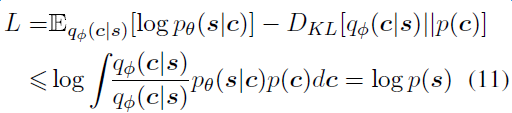
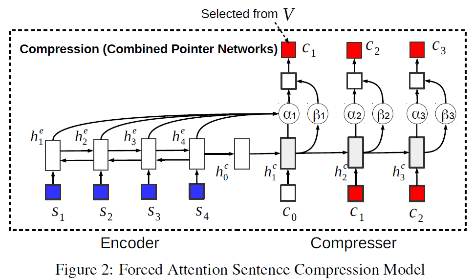

# 任务

> We formulate a variational auto-encoder for inference in this model and apply it to the task of compressing sentences.

* 主要任务是使用VAE进行句子压缩. 只不过本文的一个特点是, 压缩的中间结果不是向量空间中的一个点, 而是压缩成实际的文本串.

* 文章模型的另外一个特点就是在进行句子压缩过程中, 最终压缩使用的词都是原始文本中出现的. 通过这样来大大减少VAE的搜索空间.

* 文章joint两个网络: ASC和FSC进行学习. 无监督的ASC用于学习句子的compresser distribution, 有监督的FSC用来约束ASC生成比较正常的压缩文本

# 模型

* 文章的模型主要有两个部分组成: 无监督的ASC, 有监督的FSC
	- ASC (Auto-encoding Sentence Compression): 主要是为了学习压缩句子.
	- FSC (Forced-attention Sentence Compression): 主要是在ASC压缩过程中添加约束.

> we propose a generative auto-encoding sentence compression (ASC) model, where we introduce a latent language model to provide the variablelength compact summary

* ASC
	- 模型的总体结构为:
		* 
	- 使用了VAE的网络结构进行学习. 主要包括四个RNN: encoder, compressor, decoder和一个pre-trained语言模型
	- 语言模型主要是用来对压缩过程进行约束, 保证生成一些相对正常的文本, 参见VAE的loss函数
	- encoder-compresser
		* 基于pointer network
		* encoder:由Bi-LSTM来encode sourcce sentence
		* compresser: 基于LSTM生成压缩文本串, 所有生成的的word, 都是source sentence中曾出现的word.
	- compresser-decoder
		* commpresser: 同样使用上一部分的网络结构来对压缩的文本串进行encoder, 只是不再使用source sentence中的信息.
		* decoder: 使用了基于soft attention的序列到序列的模型来生成sentence

	- Loss函数
		* 		
		* 可以看出loss包含了两部分的loss
			+ 尽量让生成的new sentence接近source sentence
			+ 尽量让中间压缩的文本串compresser sentence的分布接近pre-trained的语言模型分布.
		* 为了防止模型中LM的loss影响太大, 导致模型倾向于学习语言模型, 本文对loss进行了修正, 对loss中的KL loss增加了一个lambda因子(0.1)来降低语言模型的loss权重, 类似于一种正则化.

> we introduce supervised forced-attention sentence compression (FSC) model to teach the compression model to generate coherent compressed sentences.

* FSC
	- 模型的总体结构为: 
		* 
	- FSC和ASC共享了encoder-compresser网络
		* 区别是FSC在compresser阶段predict的word是整个vocabulary, 而不再局限于source word
	- Force-attention
		* 是一种compresser过程中如何选择word的strategy: 是选择source sentence中的word, 或者在V词表中predict 一个word

# 实验
* 半监督训练
	- 语料: 原始句子集合S作为无监督的语料, 有标注的sentence-compression 平行语料作为有监督的语料
	- 模型通过joint ASC和FSC网络一起进行学习.
* 语料
	- labelled data: 选择一批文章, 使用文章的第一句话作为文章对应的压缩文本表示.

# 结论

* 这篇论文提到的模型有一些复杂, 常见的技术: LSTM, VAE, JOINT Model都用上了. 而且为了适应任务, 对VAE的loss进行修正. 
* 文章对网络模型结构讲解的比较细致
* 文章的主要思想是通过joint两个模型来学习压缩sentence, 将长文本压缩成短文本.