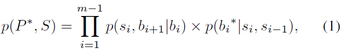

> This paper takes on the challenge of designing a phrasal segmentation model to improve the quality of extracted phrases. 

# 任务
* 本文的任务很简单:短语抽取. 相比以往的规则知识和统计方法, 这篇论文提的方法稍微扩展性强了一些. 
* 短语抽取方法
    - rule-based
        + 基于NLP规则知识的短语抽取方法, 是最早的短语抽取方法.
    - frequent pattern
        + 基于统计的短语抽取方法,暴力解决.
* 感觉本文并没有什么特别之处, 只是把短语抽取定义为了一种寻找分割点的最优化问题, 并量化了各个分割点的score函数. 类似于分词的做法. 为了寻找最优分割点, 文章使用了一种动态规划的方式去寻找, 主要是因为要枚举出来各种可能的分割点.
* 模型的分割点score定义为:
    - 这个score由两部分组成:  inter-cohesion 和 inter-isolation
    - p(si, bi+1|bi) 表示了phrase的衔接性, 是phrase  si出现的条件概率.
    - p(bi*|si,si-1) 表示了inter-isolation 是分割点出现的条件概率

# 结论

* 论文很简单, 提出了一种量化进行phrase extraction的模型, 后面的实验和动态规划没有细看, 估计做法也是一样的. 
* 不是我们想要的
