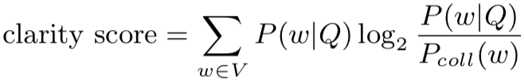
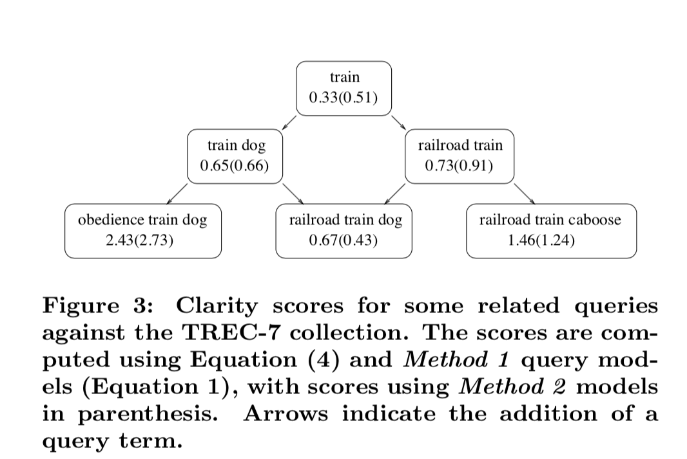

Introduction：
Thus we seek to measure the degree of ambiguity of a query with respect to a collection of documents。
为了事先评估query召回结果的相关性或者说query的歧义性，本文提出了一个无监督的方法。通过语言模型来计算query和document之间的相对熵（KL距离）的方法。期望通过这个score来评估query与召回结果之间的相关性。

作者称这个方法为：clarity score。基本假设为：
A query whose highly ranked documents are about a single topic (high coherence) has a model characterized by unusu- ally large probabilities for a small number of topical terms.

low-coherence的query召回的doc中，排名靠前的可能包含很多不相关的doc，而high-coherence的query召回的doc中排名靠前的大都是相关的doc。
因此clarity score和query以及召回的doc都有关系。

计算clarity score
本文同样是使用语言模型来计算clarity score，不过这里的语言模型可能是在query，doc或者query召回的doc集合上计算。

- query language model
  - 第一步是计算query 语言模型：这里是采用了Lavrenko and Croft的方法
  - 假设：query和doc中的term都是根据query unigram分布来生成的。
  - 
    - R is the set of documents that contain at least one query term.
      - 这里有个问题吧？至少包含query中的一个term？
    - P (D|Q) 通过如下公式进行计算
      - 
      - 通过D的语言模型分布来计算Q的概率。P (w|D) and P (q|D) 都是根据term在D中的频率线性平滑计算得到的
        - P(w|D) = λPml(w|D) + (1 − λ)Pcoll(w)
        - Pml(w|D) ：w在D中出现的相对频率
        - Pcoll(w)：w在整个召回集合中的相对频率
- 定义
  - clarity score就是query和doc unigram语言模型分布之间的相对熵（KL散度）
  - 
    - 不过有个疑问：为什么是Pcoll(w)， 按照公式应该是P(w|D)吧？
      - Pcoll(w)是整体集合上的w的概率分布，而D是具体到某个具体doc了
    - 关键点就在于P(w|Q)的计算，其它都可以离线计算好。P(w|Q)可以对D进行抽样来计算。这篇论文是最多抽取了500个doc

